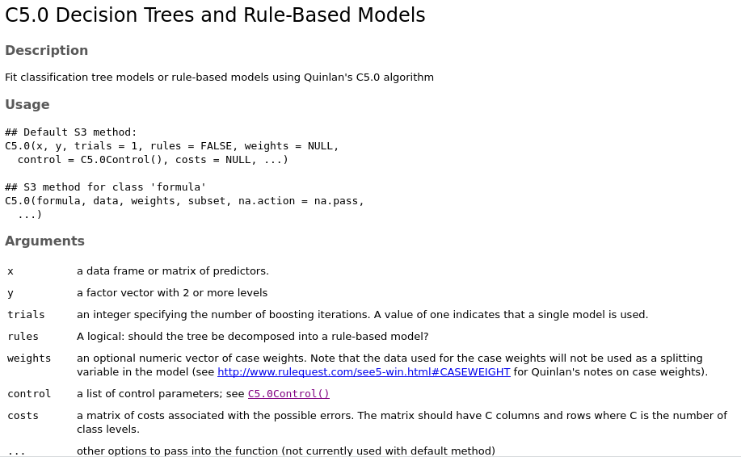

```{r setup, include=FALSE}
knitr::opts_chunk$set(echo = TRUE)
```

## Árboles de decisión (C5.0)
### Identificación de riesgos en préstamos bancarios

Desde la crísis financiera mundial de 2007-2008 se puso de relieve la importancia de la transparencia y el rigor en las prácticas bancarias. Dada la escasez del crédito, los bancos han ajustado sus sistemas de préstamos y han mirado hacia el *machine learning* para identificar de forma mas precisa los riesgos en préstamos.

Los árboles de decisión son ampliamente usados en la industria financiera debido a su alta precisión y a su capacidad de formular un modelo estadístico en lenguaje común. Debido a que los gobiernos supervisan cuidadosamente las précticas crediticias, los ejecutivos deben ser capaces de explicar porqué fue rechazado un crédito a un cliente mientras que le fue aprobado a otro. Esta información es útil también para el cliente quien puede determinar si su calificación de riesgo es o no satisfactoria.

En este artículo desarrollamos un modelo sencillo de aprobación de créditos usando árboles de decisión C5.0. También veremos como ajustar los resultados del modelo para minimizar errores que puedan resultar en pérdidas financieras para la institución.

### Paso 1 - Recolección de datos

La idea del modelo de crédito es identificar los factores que son predictivos de un alto riesgo de incumplimiento. Por lo tanto, se necesita recolectar un gran número de préstamos bancarios anteriores, e identificar los que fueron objeto de incumplimiento, así como información sobre los solicitantes.

Un conjunto de datos con estas características fue donado por el UCI Machine Learning Data Repository (http://archive.ics.uci.edu/ml) por Hans Hofmann de la universidad de Hamburgo. El conjunto de datos contiene información sobre préstamos obtenidos de una entidad crediticia alemana.

El archivo contiene 1.000 ejemplos de créditos, más un conjunto de características numéricas acerca del préstamo y del cliente. Una variable *class* indica si el préstamo fue impagado. Veamos si podemos determinar patrones que produzcan este resultado.

### Paso 2 - Exploración y preparación de los datos

Importaremos el archivo con *read.csv()* e ignoraremos la opción *stringsAsFactor*, usando su opcion por defecto TRUE, ya que la mayoría de las características de los datos son nominales:

```{r}
credito <- read.csv("credit.csv")
```
Las primeras líneas que genera la función *str()* son:
```{r}
str(credito)
```
Vemos las 1.000 observaciones esperadas y sus 17 características, que incluyen tipos de datos *factor* y *entero*.

Veamos la salida de *table()* para un par de características que podrían predecir el impago. El saldo de cuenta (checking_balance) y el saldo de ahorros (savings_balance) del solicitante se guardaron como variables categóricas:
```{r}
table(credito$checking_balance)
table(credito$savings_balance)
```
Los balances de cuenta podrían probar ser importantes predictores del estado de impago de los créditos. Nótese que dado que los datos fueron obtenidos de Alemania, la moneda es el marco alemán (Deutsche Mark - DM).

Algunas de las características del préstamo son numéricas, como la duración del préstamo y la cantidad solicitada.
```{r}
summary(credito$months_loan_duration)
summary(credito$amount)
```
Las cantidades prestadas van de 250 DM a 18.424 DM y entre 4 y 72 meses, con una duración media de 18 meses y promedio de 2.320 DM.

El vector *default* indica si el aplicante del crédito fue incapaz de cumplir con los términos del préstamo y cayó en impago. El 30 porciento de los préstamos del conjunto fueron imapagados.

```{r}
table(credito$default)
```
Una alta taza de impagos es indeseable para un banco, ya que implica que la entidad no recupere en su totalidad la inversión. Si tenemos éxito nuestro modelo identificará solicitantes con un alto riesto de impago, permitiento al banco rechazar las solicitudes.

#### Preparación de los datos
##### Creación de conjuntos aleatorios de datos para entrenamiento y prueba

Partiremos el conjunto de datos en dos: un conjunto de entrenamiento para construir el arbol de decisión y un conjunto de prueba para evaluar el rendimiento del modelo sobre datos nuevos. Usaremos 90% de datos para entrenamientto y 10% para prueba.

Los datos no estan aleatoriamente distribuidos en el conjunto. Suponiendo que el banco ordenó los datos ascendentemente por cantidad del préstamo, nos hallaríamos entrenando el modelo con pequeños créditos y probándolo con los mayores. Obviamente esto es problematico.

Resolvemos el problema usando una muestra aleatoria de los datos para entrenamiento. Este es un proceso que selecciona al azar un subconjunto de los datos. En **R**, esto se consigue usando la función *sample()*. Es una práctica común iniciar con un valor semilla (seed), que obliga al proceso de aleatorización a seguir una secuencia que pueda ser replicada posteriormente. 

Las siguientes instrucciones usan la función *sample()* para seleccionar 900 valores al azar dentro de una secuencia de 1 a 1000. Usaremos el valor arbitrario *123* como semilla. Si se omite la semilla, el proceso de aleatorización diferirá cada vez que se ejecute la función. 

```{r}
set.seed(123)
muestra_entrenamiento <- sample(1000, 900)
```
Según lo esperado, el objeto *muestra_entrenamiento* es un vector de 900 enteros aleatorios.
```{r}
str(muestra_entrenamiento)
```
Usaremos este vector para seleccionar filas del archivo de crédito, y dividirlo en dos conjuntos: 90% para entrenamiento y 10% para prueba.
```{r}
credito_train <- credito[muestra_entrenamiento, ]
credito_test <- credito[-muestra_entrenamiento, ]
```
Si todo marchó bien, tendremos cerca del 30% de créditos impagados en cada conjunto de datos.
```{r}
prop.table(table(credito_train$default))
prop.table(table(credito_test$default))
```
Hemos encontrado una particion bastante justa. Ahora podemos construir nuestro arbol de decisión.

### Paso 3 - Entrenamiento del modelo con los datos

Usaremos el algoritmo C5.0 del paquete *C50* para entrenar nuestro modelo de árbol de decisión. Si no lo ha hecho, instale el paquete con *install.packages("C50")* y cárguelo en su sesión de R con *library(C50)*.



When you click the **Knit** button a document will be generated that includes both content as well as the output of any embedded R code chunks within the document. You can embed an R code chunk like this:

```{r cars}
summary(cars)
```

## Including Plots

You can also embed plots, for example:

```{r pressure, echo=FALSE}
plot(pressure)
```

Note that the `echo = FALSE` parameter was added to the code chunk to prevent printing of the R code that generated the plot.
